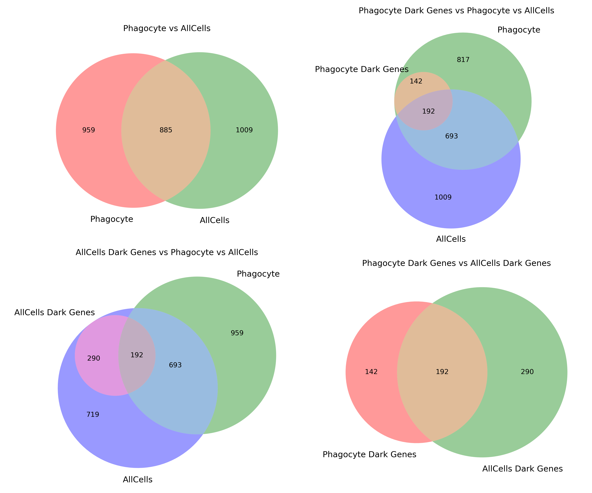

# results/

This directory contains analysis outputs and results. The results are divided according the different datasets.

Reminder of the datasets and their subsets:

## Contents
- Figures and plots
- Tables and statistics
- Processed data files
- Analysis reports

## Note
Result files should generally not be committed to the repository. Use `.gitignore` to exclude them.
